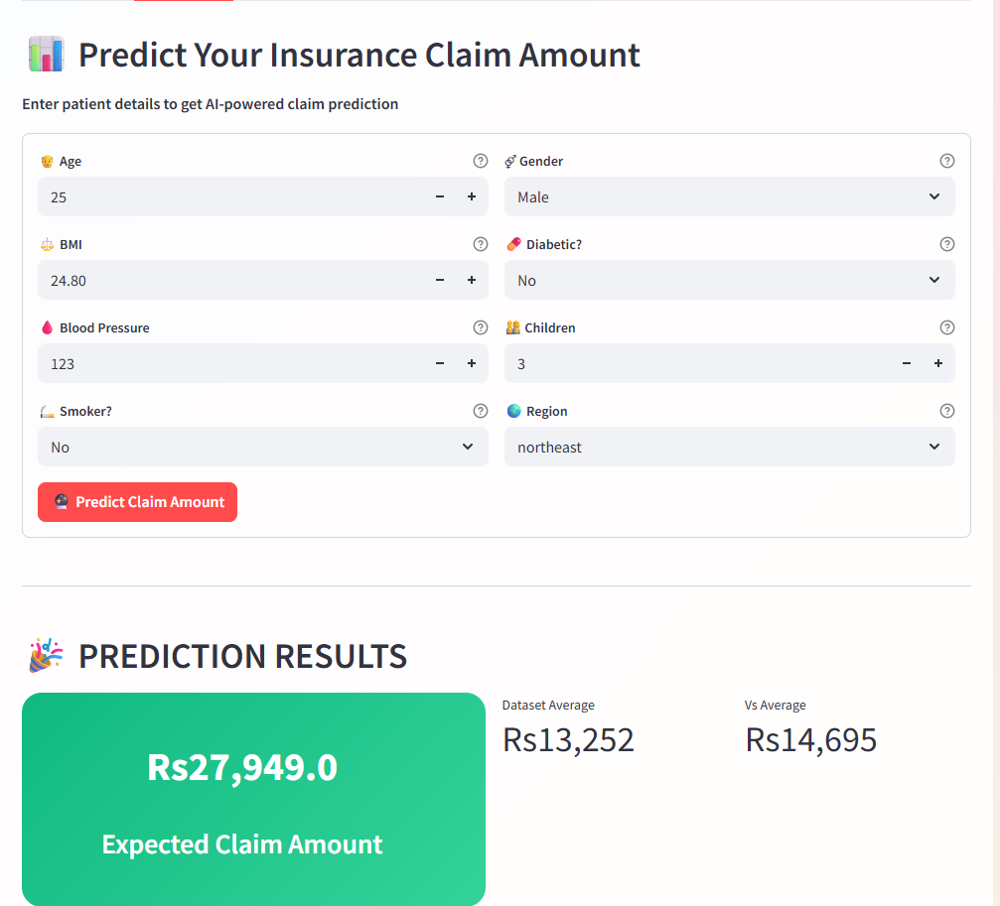
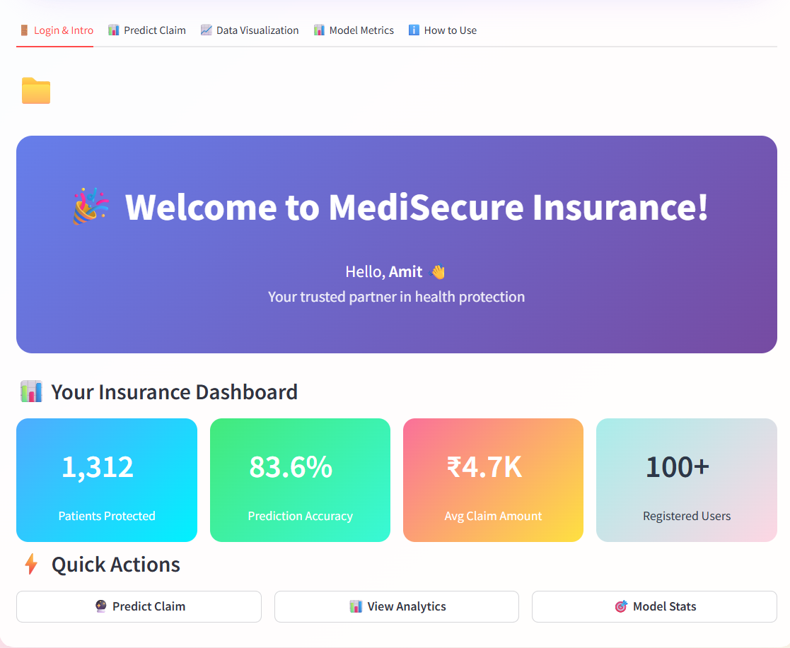
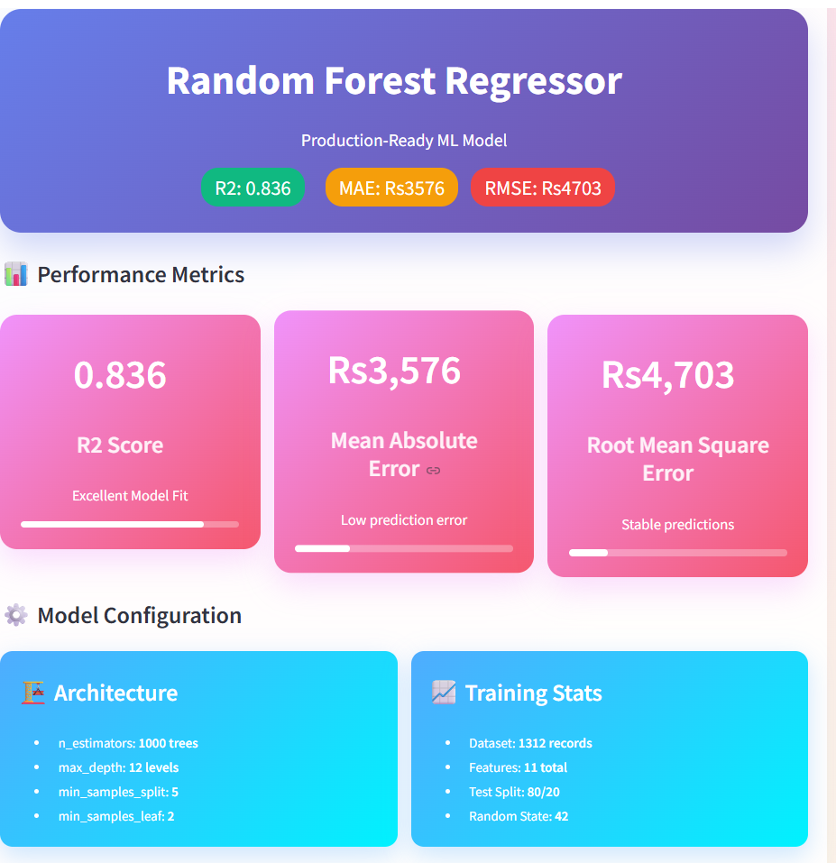
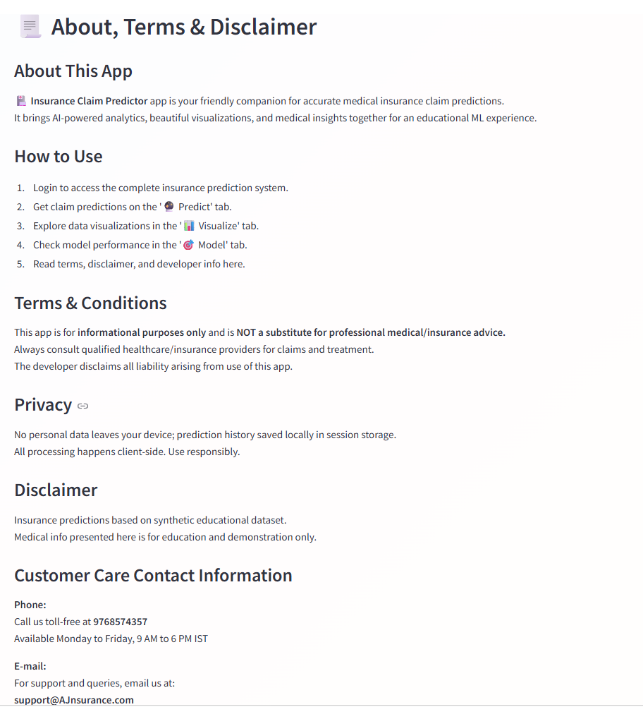

# Smart Insurance Claim Predictor



A machine learning-powered web application that predicts health insurance claim amounts using customer demographic and medical information. The project combines predictive analytics, interactive visualizations, and a user-friendly interface to provide insurance claim estimations in real time.

---

## Overview

Smart Insurance Claim Predictor is built using Python, Streamlit, and Scikit-Learn. The application uses a trained Random Forest Regression model to estimate insurance claim amounts based on factors such as age, BMI, smoking habits, blood pressure, diabetes status, and region.

The system also includes interactive dashboards, model performance analysis, prediction tracking, and data visualization capabilities.

---

## Features

* Insurance claim amount prediction
* User authentication system
* Interactive analytics dashboard
* Data visualization using Plotly
* Model performance evaluation
* Prediction history tracking
* Correlation analysis
* Responsive Streamlit interface
* Local data storage

---

## Screenshots

### Login Page


### Claim Prediction


### Analytics Dashboard


### Model Performance & Metrics


### About & User Guide

---

## Project Structure

```text
Insurance-Claim-Predictor/
│
├── app.py
├── analysis_model.ipynb
├── insurance_model.pkl
├── insurance_data.csv
├── customer_data.xlsx
├── requirements.txt
├── screenshots/
│   ├── login.png
│   ├── prediction.png
│   ├── dashboard.png
│   ├── model_metrics.png
│   └── about_page.png
│
├── README.md
└── .gitignore
```

---

## Technologies Used

* Python
* Streamlit
* Pandas
* NumPy
* Scikit-Learn
* Plotly
* Matplotlib
* Seaborn
* OpenPyXL

---

## Machine Learning Model

### Algorithm

Random Forest Regressor

### Input Features

* Age
* Gender
* BMI
* Blood Pressure
* Diabetes Status
* Number of Children
* Smoking Status
* Region

### Engineered Features

* Age × BMI
* BMI × Blood Pressure
* Age × Smoker

### Model Evaluation Metrics

The application includes model evaluation using:

* R² Score
* Mean Absolute Error (MAE)
* Root Mean Squared Error (RMSE)

---

## Installation

### Clone the Repository

```bash
git clone https://github.com/AmitSharma9754/Insurance-Claim-Predictor.git
cd Insurance-Claim-Predictor
```

### Install Dependencies

```bash
pip install -r requirements.txt
```

### Run the Application

```bash
streamlit run app.py
```

After running the command, Streamlit will automatically open the application in your browser.

---

## Application Modules

### User Authentication

Provides secure access to the application through login verification.

### Claim Prediction

Predicts insurance claim amounts using a trained machine learning model.

### Data Visualization

Interactive charts and graphs for exploring insurance data patterns.

### Model Metrics

Displays performance metrics and evaluation results.

### Prediction History

Stores and displays previously generated predictions.

### About Section

Provides project information, usage instructions, and disclaimer details.

---

## How to Use

1. Login using valid credentials.
2. Navigate to the Prediction section.
3. Enter customer information.
4. Click **Predict Claim Amount**.
5. Review the predicted insurance claim.
6. Explore visualizations and model metrics.

---

## Future Improvements

* User registration system
* Cloud database integration
* PDF report generation
* Advanced machine learning models
* API integration
* Multi-language support

---

## Disclaimer

This project was developed for educational and learning purposes.

Predicted insurance claim amounts are generated using a machine learning model trained on sample data and should not be considered official insurance decisions.

Users should consult qualified insurance professionals before making financial or healthcare-related decisions.

---

## Author

**Amit Sharma**

GitHub: https://github.com/AmitSharma9754

Email: [amitsharma97545@gmail.com](mailto:amitsharma97545@gmail.com)
